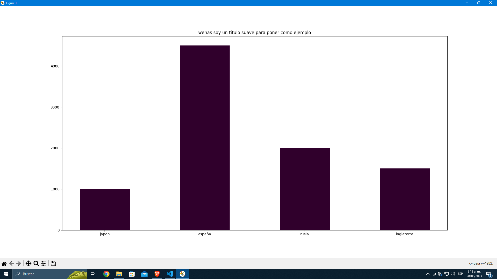
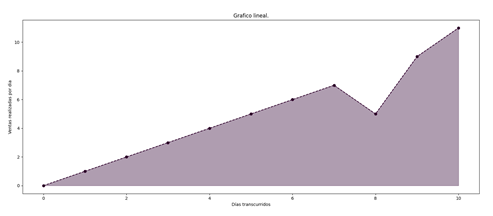
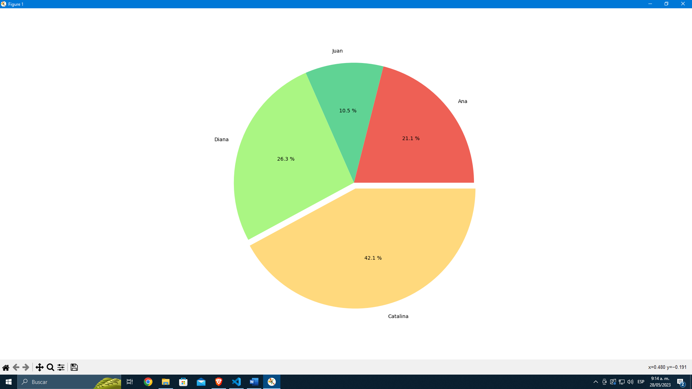
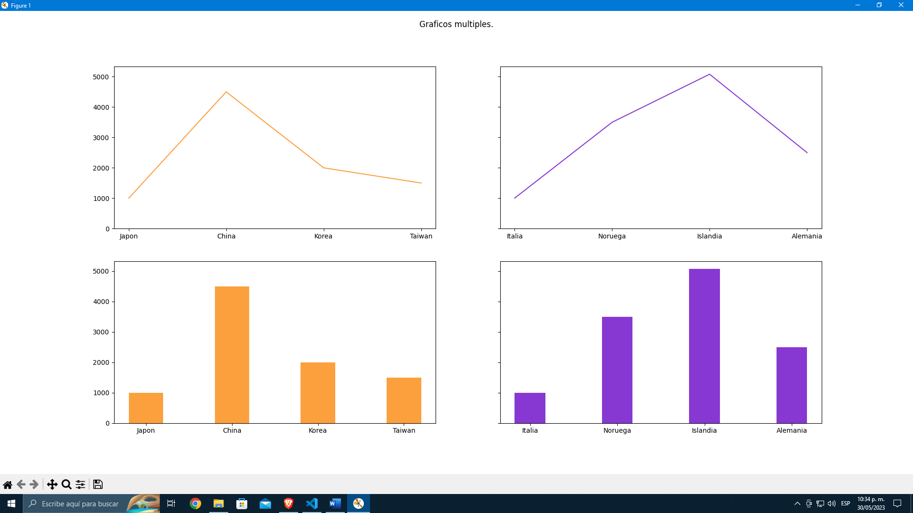

# Graphs_in_python
 In the following repository it is recovered quickly, python graphs, generally used to generate reports, more will be added over time... / En el siguiente repositorio se recopila de manera rápida, graficas de Python, generalmente usadas para generar reportes, se irán agregando más con el tiempo...

## Requisitos previos
* Python [python download](https://www.python.org/downloads/release/python-31010/)
* pip [pip download](https://pip.pypa.io/en/stable/installation/)
---


```sh
# Clonar el repositorio
git clone https://github.com/deividbautista/Graphs_in_python.git
```

```sh
# Instalar las dependencias que necesitaremos en este proyecto
pip install -r dependencies.txt 
```


<details>
<summary><strong style="font-size: 20px;">Basic Graphs/Graficos Basicos</strong></summary>





</details>


<details>
<summary><strong style="font-size: 20px;">Interactive 3D Graphics / Graficos Interactivos 3D</strong></summary>


</details>